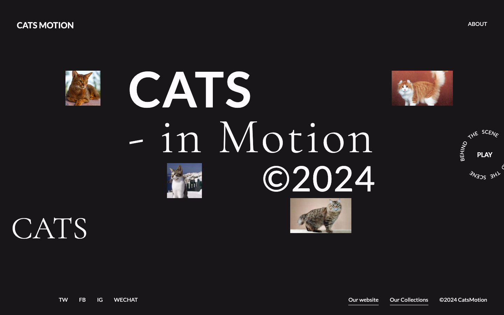
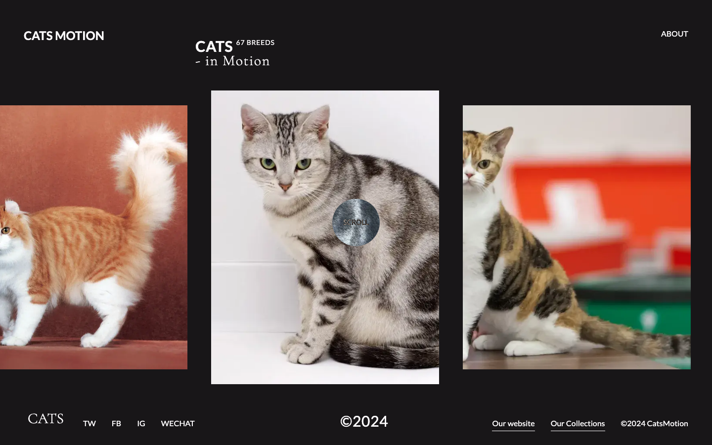
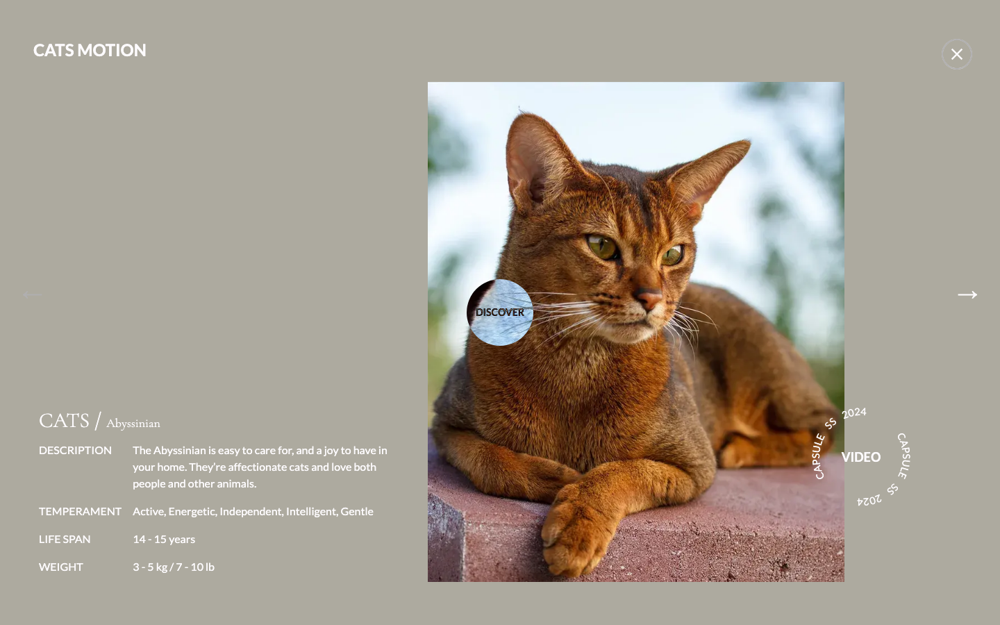

# Cats in Motion

Cats in Motion is a visually-driven Next.js website showcasing cat breeds through rich animations and smooth interactions. Browse a full-screen draggable carousel of breeds, click any card to open an animated detail view, and watch the layout come alive with 3D parallax, custom cursor states, and fluid Framer Motion transitions throughout. Created by Denys Nykoriak.

## Motivation

The goal was to build a website that feels genuinely alive — one where every interaction has a considered motion response. The intro sequence reacts to mouse position, the carousel slides and snaps with elastic drag constraints, and breed details animate in with coordinated entrance sequences. Framer Motion made it practical to compose complex multi-element choreography without fighting CSS keyframes. The cat breed domain (via The Cat API) provided a rich, image-heavy data set that gave those animations real content to work with.

## Project structure

| Directory / File                            | Description                                                                                                     |
| ------------------------------------------- | --------------------------------------------------------------------------------------------------------------- |
| [src/app/](./src/app)                       | Next.js App Router pages and layout. `home/` contains the main view and carousel/modal components.              |
| [src/app/components/](./src/app/components) | Shared UI: custom cursor, circular spinning text, logo, close button, and icon primitives.                      |
| [src/api/](./src/api)                       | Thin wrapper around The Cat API (axios).                                                                        |
| [src/services/](./src/services)             | Build-time breed data fetching and image caching; manifest written to `public/cached-cats/`.                    |
| [src/hooks/](./src/hooks)                   | `useMouseMoveAnimation` for 3D parallax, `usePreloadImages` for ahead-of-time carousel image loading.           |
| [src/config/](./src/config)                 | Shared Framer Motion easing constants.                                                                          |
| [scripts/](./scripts)                       | `cacheCatData.ts` — runs at prebuild to snapshot breed images locally so the app has no runtime API dependency. |

## Getting started

1. Install dependencies: `yarn install`.
2. Add a `.env.local` file at the project root with your Cat API key: `NEXT_PUBLIC_CAT_API_KEY=your_key_here`.
3. Run the development server: `yarn dev` (app on http://localhost:3000).
4. For a production build: `yarn build && yarn start` — the prebuild step caches all breed images automatically.

## Technologies

| Layer      | Stack                                                                    |
| ---------- | ------------------------------------------------------------------------ |
| Framework  | Next.js 14, React 18, TypeScript                                         |
| Animations | Framer Motion (spring physics, AnimatePresence, motion values, controls) |
| Styling    | Tailwind CSS, custom fonts (Lato, Cormorant Garamond)                    |
| Data       | The Cat API via axios; build-time image caching with tsx                 |
| Tooling    | ESLint, Prettier, eslint-plugin-tailwindcss                              |

## Planned improvements

- **Mobile layout** — adapt the carousel and intro for touch devices and smaller viewports.
- **Breed search** — filter the carousel by name or temperament without leaving the page.
- **Video integration** — wire up the "VIDEO" circular-text element in the breed detail view to actual breed video content.
- **Accessibility** — add keyboard navigation for the carousel and modal, and respect `prefers-reduced-motion`.

## License

See [LICENSE](LICENSE).
